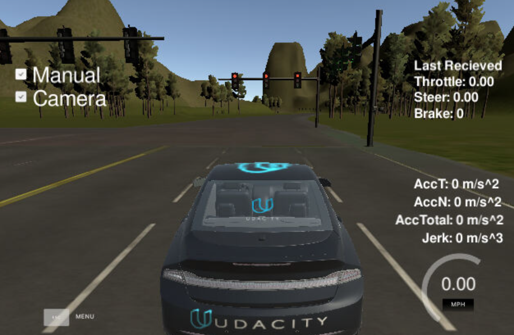

#### Basic Information
Liping Shi  shi.liping@hotmail.com

### Software Architecture


### Follow the suggested Order of Project Development
Completing the project in the following order:

- Waypoint Updater Node (Partial): Complete a partial waypoint updater which subscribes to /base_waypoints and /current_pose and publishes to /final_waypoints.
- DBW Node: Once your waypoint updater is publishing /final_waypoints, the waypoint_follower node will start publishing messages to the/twist_cmd topic. At this point, you have everything needed to build the dbw_node. After completing this step, the car should drive in the simulator, ignoring the traffic lights.
- Traffic Light Detection: This can be split into 2 parts:
  - Detection: Detect the traffic light and its color from the /image_color. The topic /vehicle/traffic_lights contains the exact location and status of all traffic lights in simulator, so you can test your output.
  - Waypoint publishing: Once you have correctly identified the traffic light and determined its position, you can convert it to a waypoint index and publish it.
- Waypoint Updater (Full): Use /traffic_waypoint to change the waypoint target velocities before publishing to /final_waypoints. Your car should now stop at red traffic lights and move when they are green.

### Waypoint Updater Node

The waypoint node subscribes to four topics: /current_pose to get the location of the car itself;/current_velocity to get the linear and angular velocity; /base_waypoints to get the entire list of waypoints; /traffic_waypoint to get the stopping waypoint corresponding to the red light. Given those inputs it publishes a list of waypoints, which contains a position on the map and a target velocity. The final list of waypoints is published on the /final_waypoints topic.

The node has an iteration at 10hz on finding the closest waypoints and look ahead 200 waypoints. The velocity of the waypoint will be updated when the topic /traffic_waypoint updates. The closer to the red traffic light, the larger deceleration will used on the car.


### Traffic Light Detection Node

The traffic light detection node subscribes to four topics: /traffic_lights to get the traffic light's position in 3D space; /image_color to provide an image stream from the car's camera. These images are used to determine the color of upcoming traffic lights; /base_waypoints to provide the complete list of waypoints for the course; /current_pose for determining the vehicle's location.
The node publishs the index of the waypoint for nearest upcoming red light's stop line to a single topic:

The node has an iteration at 3 hz. It searches the closest waypoint and identifies the closest traffic light, and detects the color of the light.


The object detector: faster_rcnn_inception_v2 (Tensorflow detection model zoo https://github.com/tensorflow/models/blob/master/research/object_detection/g3doc/detection_model_zoo.md) is selected on object detection. Bounding box will be extract around the traffic light.

The colour recognition: classic computer vision is used to recognise the traffic light. Use RED mask and high L and high S (HLS) to extract the light points. Then get the centre of light points and the position of the centre related to the bounding box.

- 1/3 upper part : red
- 2/3 middle part : yellow
- 3/3 lower part : green


### DBW node

The DBW node subscribes topic /twist_command, which provides target linear and angular velocity sent by waypoint_follower. It publishes command topics to control steering, throtlle, and brake. The update iteration is 50 hz, as required by the Udacity guide.

```
steering_angle:  atan(L/R) with L=wheel_base and R=radius_of_curvature=linear_velocity/angular_velocity=ds/dtheta

acceleration:  (target_velocity - current_velocity) / duration

torque:  vehicle_mass * acceleration * wheel_radius

throttle:  [0; 1] corresponding to max acceleration

brake: if throttle < -(brake_deadband)
          use abs(torque)

```

### Test on Simulator
1. Test dbw_node and waypoint_updater_node: the car can drive in the simulator, ignoring the traffic lights. Note both the 'Manual' and Camera are not selected.


2. Test Traffic Light Detection Node
Test the traffic light detection: Note both the 'Manual' and Camera are selected.


The detection result:
```
[WARN] [1548949973.835634]: [traffic_cb]
[INFO] [1548949974.162151]: RED Light Detection Confidance: 0.99
[INFO] [1548949974.163154]: Traffic Light: RED
```

### Issues

Experienced an issue with the Simulator. While enabling the camera signal, it results in significant lag, which causes the PID to be unable to maintain control of the steering. It appears to be a known issue, discussed on slack. (https://github.com/udacity/sdc-issue-reports/issues/1217)


------------------------

This is the project repo for the final project of the Udacity Self-Driving Car Nanodegree: Programming a Real Self-Driving Car. For more information about the project, see the project introduction [here](https://classroom.udacity.com/nanodegrees/nd013/parts/6047fe34-d93c-4f50-8336-b70ef10cb4b2/modules/e1a23b06-329a-4684-a717-ad476f0d8dff/lessons/462c933d-9f24-42d3-8bdc-a08a5fc866e4/concepts/5ab4b122-83e6-436d-850f-9f4d26627fd9).

Please use **one** of the two installation options, either native **or** docker installation.

### Native Installation

* Be sure that your workstation is running Ubuntu 16.04 Xenial Xerus or Ubuntu 14.04 Trusty Tahir. [Ubuntu downloads can be found here](https://www.ubuntu.com/download/desktop).
* If using a Virtual Machine to install Ubuntu, use the following configuration as minimum:
  * 2 CPU
  * 2 GB system memory
  * 25 GB of free hard drive space

  The Udacity provided virtual machine has ROS and Dataspeed DBW already installed, so you can skip the next two steps if you are using this.

* Follow these instructions to install ROS
  * [ROS Kinetic](http://wiki.ros.org/kinetic/Installation/Ubuntu) if you have Ubuntu 16.04.
  * [ROS Indigo](http://wiki.ros.org/indigo/Installation/Ubuntu) if you have Ubuntu 14.04.
* [Dataspeed DBW](https://bitbucket.org/DataspeedInc/dbw_mkz_ros)
  * Use this option to install the SDK on a workstation that already has ROS installed: [One Line SDK Install (binary)](https://bitbucket.org/DataspeedInc/dbw_mkz_ros/src/81e63fcc335d7b64139d7482017d6a97b405e250/ROS_SETUP.md?fileviewer=file-view-default)
* Download the [Udacity Simulator](https://github.com/udacity/CarND-Capstone/releases).

### Docker Installation
[Install Docker](https://docs.docker.com/engine/installation/)

Build the docker container
```bash
docker build . -t capstone
```

Run the docker file
```bash
docker run -p 4567:4567 -v $PWD:/capstone -v /tmp/log:/root/.ros/ --rm -it capstone
```

### Port Forwarding
To set up port forwarding, please refer to the [instructions from term 2](https://classroom.udacity.com/nanodegrees/nd013/parts/40f38239-66b6-46ec-ae68-03afd8a601c8/modules/0949fca6-b379-42af-a919-ee50aa304e6a/lessons/f758c44c-5e40-4e01-93b5-1a82aa4e044f/concepts/16cf4a78-4fc7-49e1-8621-3450ca938b77)

### Usage

1. Clone the project repository
```bash
git clone https://github.com/udacity/CarND-Capstone.git
```

2. Install python dependencies
```bash
cd CarND-Capstone
pip install -r requirements.txt
```
3. Make and run styx
```bash
cd ros
catkin_make
source devel/setup.sh
roslaunch launch/styx.launch
```
4. Run the simulator

### Real world testing
1. Download [training bag](https://s3-us-west-1.amazonaws.com/udacity-selfdrivingcar/traffic_light_bag_file.zip) that was recorded on the Udacity self-driving car.
2. Unzip the file
```bash
unzip traffic_light_bag_file.zip
```
3. Play the bag file
```bash
rosbag play -l traffic_light_bag_file/traffic_light_training.bag
```
4. Launch your project in site mode
```bash
cd CarND-Capstone/ros
roslaunch launch/site.launch
```
5. Confirm that traffic light detection works on real life images
